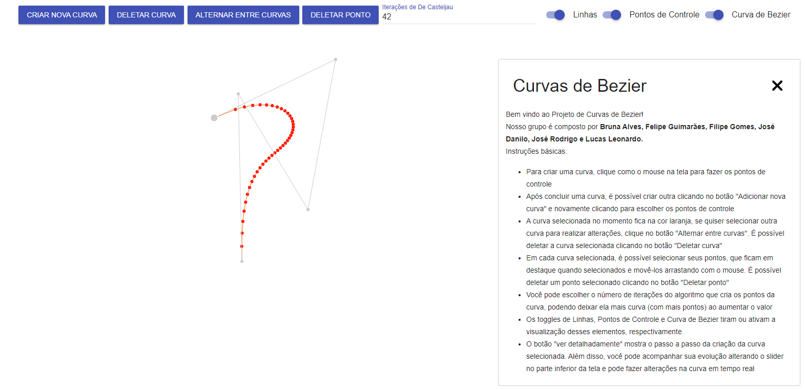
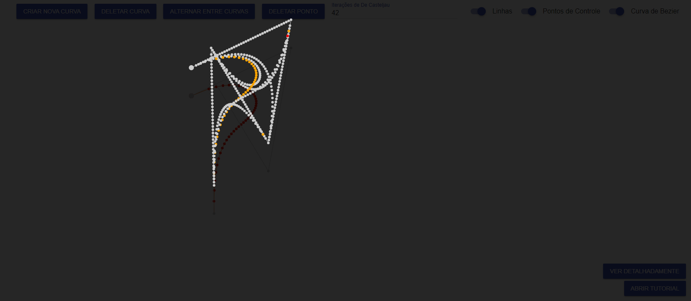

# JavaScript: Bezier Curves

> The project aims to generate bezier curves through the deCasteljau algorithm during the graphic processing discipline.

Can be accessed through the following [link](https://jdaniloc.github.io/Projeto-IF680-2022/).

## Features
- Create more than one curve
- Delete an entire curve or just the points on a curve
- Switch between curves and edit their points
- Increase the number of points
- Hide lines, control points and curves
- Check the curve generation process

